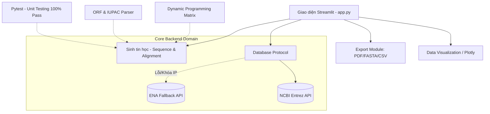

# 🧬 AgriGene Explorer v2.0

> **Nền tảng Sinh tin học (Bioinformatics) chuyên sâu cho Tra cứu, Phân tích và Căn chỉnh Trình tự Gen Nông nghiệp & Y Sinh.**

**AgriGene Explorer** là ứng dụng web tương tác được xây dựng bằng [Streamlit](https://streamlit.io/), giúp các nhà nghiên cứu sinh học nông nghiệp và sinh tin học dễ dàng tìm kiếm, tra cứu và phân tích các trình tự gen từ cơ sở dữ liệu quốc gia về thông tin công nghệ sinh học (NCBI). Dự án được thiết kế chuyên biệt cho nghiên cứu học thuật với kiến trúc chuẩn mực (Domain-Driven Design), thuật toán tối ưu và hiệu năng cao.

---

## 🎯 Đặt vấn đề Sinh học (Biological Context)

Trong Nông nghiệp hiện đại, việc cải tạo giống cây trồng hoặc phát hiện sớm mầm bệnh đòi hỏi việc đối chiếu trình tự DNA siêu tốc. 

**Ví dụ thực tiễn:** Gen Kháng Bệnh Đạo Ôn *(Rice Blast)* mang tên `Pi54` ở Lúa (*Oryza sativa*). Các nhà chọn giống cần tải chuỗi mẫu này từ NCBI, phân tích khung đọc mở (ORF), dịch mã thành chuỗi Axit Amin và thực hiện **Căn chỉnh trình tự (Alignment)** để so sánh với một mẫu ngoài đồng ruộng xem có bị đột biến điểm dẫn đến mất khả năng kháng bệnh hay không.

Ứng dụng của chúng tôi **tự động hóa hoàn toàn** luồng công việc phức tạp này.

---

## 🚀 Các Tính Năng Cốt Lõi

1. **🔍 Tìm kiếm Gen Nông Nghiệp & Truy xuất Dữ liệu (Entrez/NCBI)**
   - Tìm kiếm trình tự gen phân loại theo *CDS, mRNA, rRNA*...
   - Tự động hóa gọi API NCBI lấy chuẩn xác Metadata.
   - Xuất dữ liệu hàng loạt dưới cấu trúc báo cáo nhanh (CSV/Excel).

2. **🧬 Phân tích Dải Trình tự (Sequence Analysis & Translation)**
   - Thống kê tỷ trọng sinh học cơ bản: Chiều dài chuỗi, Hàm lượng GC%, Mật độ AT/GC.
   - Tìm kiếm **Khung đọc mở (Open Reading Frames - ORF)** trên 3 chiều phân tích khác nhau và Dịch mã trực tiếp sang chuỗi Protein.
   - **Làm sạch chuẩn quốc tế:** Hỗ trợ xử lý toàn diện bộ chuẩn đa hình **IUPAC** (R, Y, M, N...) và lọc các kí tự dư thừa (`\n`, `\r`, whitespace) từ dòng dữ liệu thô.

3. **🔬 Căn chỉnh Trình tự (Sequence Alignment) tối ưu hóa**
   - Thuật toán **Needleman-Wunsch** (Căn chỉnh toàn cục - Global Alignment).
   - Thuật toán **Smith-Waterman** (Căn chỉnh cục bộ - Local Alignment).
   - Cả hai được triển khai mạnh mẽ qua **Quy hoạch động (Dynamic Programming)**, sử dụng ma trận `Numpy` tốc độ cao thay cho các phương pháp đếm tuần tự (Brute Force).

4. **📊 Hệ thống Trực quan Hóa (Visual Analytics)**
   - Dùng `Plotly` render đồ họa tương tác cho Dữ liệu Metadata.
   - Biểu đồ Doughnut về Tỷ trọng loài sinh học, Sơ đồ sóng Time-line mô tả thời điểm gen công bố.

5. **📥 Trích xuất Báo cáo Học thuật (Reporting)**
   - Đóng gói toàn bộ kết quả phân tích thành **PDF Formatted Report** chuyên nghiệp, chuẩn phong cách học thuật.
   - Tải Text ở định dạng chuẩn `FASTA`.

---

## 🏛️ Sơ đồ & Điểm Sáng Kiến Trúc Hệ Thống (Architecture)

### Sơ đồ luồng (Workflow & Dataflow)



### 🏆 Tiêu chuẩn Kiến trúc Đạt được
* **Kiến trúc Hệ thống Không điểm yếu (Zero-Fragility & Fallback):** Hệ thống có cơ chế tự động chuyển Server. Nếu NCBI chặn API vì tấn công băng thông (Rate Limit - Error 429), luồng gọi dữ liệu sẽ ngầm rẽ nhánh qua **CSDL Viện Châu Âu (ENA)** để đảm bảo người dùng không bị gián đoạn.
* **Module Hóa & Domain-Driven Design (DDD):** Tách biệt rạch ròi các khối `algo/` (Thuật toán), `db/` (Giao tiếp ngầm), `ui/` và `viz/` (Trực quan). Code không có tính rườm rà nguyên khối (monolithic).
* **Quản trị Bộ nhớ Tương tác (Cache Control):** Xử lý triệt để lỗi "Bộ đệm in dấu" trong Streamlit, đảm bảo không gian truy vấn luôn tươi mới sau mỗi lần reload.
* **Đảm bảo Chất lượng 100% (QA/QC Test):** Tỷ lệ Passed hiện hành của bộ Unit Test nằm gọn trong `tests/` đảm bảo tính toàn vẹn của mọi thuật toán logic.

---

## 🛠️ Hướng dẫn Cài đặt & Trải nghiệm (Installation)

### 1. Môi trường Yêu cầu
- Python: `3.8+`
- Trình quản lý gói: `pip`

### 2. Cài đặt chi tiết
Thực hiện các lệnh sau ở Terminal/Powershell:

```bash
# Clone dự án về máy
git clone https://github.com/your-username/AgriGene-Explorer.git
cd AgriGene-Explorer

# (Khuyến nghị) Tạo và kích hoạt môi trường ảo (Virtual Environment)
python -m venv venv
# Dành cho Windows:
venv\Scripts\activate
# Dành cho MacOS/Linux:
# source venv/bin/activate

# Cài đặt thư viện phụ thuộc
pip install -r requirements.txt

# (Tuỳ chọn) Chạy bộ test kiểm định độ chính xác:
pytest tests/

# Khởi chạy ứng dụng Web
streamlit run app.py
```

### 3. Vận hành
- Mở URL trên localhost tĩnh được Streamlit tạo ra (Thường là `http://localhost:8501`).
- Mẹo Tăng tốc: Tại tab `Cài đặt` của Web App, bạn có thể điền thông tin **Email mặc định** hoặc **Cá nhân NCBI API Key** để tăng giới hạn truy vấn từ hệ thống NCBI (từ 3 calls/sec lên 10 calls/sec).

---

## 📂 Tổ chức Thư mục (Project Structure)

```text
AgriGene-Explorer/
├── algo/                    # Khối logic sinh tin và Algorithm (Alignment, Translation, ORF)
├── db/                      # Khối xử lý Data Fetching (NCBI Entrez, Fallback Handler)
├── ui/                      # Các modules hiển thị phụ trợ, Component của Streamlit
├── viz/                     # Gói trực quan biểu đồ (Plotly Graphs)
├── tests/                   # Bộ Unit Tests (PyTest) đánh giá hệ thống
├── app.py                   # File Entrypoint khởi động Web UI
├── requirements.txt         # Danh sách Dependency Python
├── README.md                # Tài liệu mô tả dự án (File hiện tại)
└── USER_MANUAL.md           # Cẩm nang sử dụng & chi tiết cấu hình học thuật
```

---

*Phát triển bởi nhóm nghiên cứu dành cho Sinh vật học và Công nghệ thông tin.*
